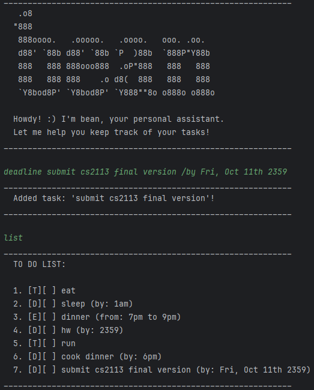

# Bean User Guide



## Product Intro
Stay organized and productive with Bean, the easy-to-use task management app.

Bean helps you:

Create and manage tasks: Easily add, edit, and delete tasks to keep track of your to-do list.
Set deadlines: Assign due dates to your tasks to stay on top of your schedule.
Categorize tasks: Organize your tasks into different categories for better management.
Mark tasks as complete: Keep track of your progress and celebrate your achievements.

With Bean, you can streamline your workflow, increase your productivity, and achieve your goals more effectively.


## Adding todos
To add a todo, use the following command: `todo [description]`
### Example:
```
todo run 10km
```
This will create a new task with description "run 10km".
### Expected output:
```
  Added task: 'run 10km'!
```


## Adding deadlines
To add a deadline, use the following command: `deadline [description] /by [by]`
### Example:
```
deadline submit cs2113 final version /by Fri, Oct 11th 2359
```
This will create a new task with the description "submit cs2113 final version" and a deadline of "Fri, Oct 11th 2359".
### Expected output:
```
  Added task: 'submit cs2113 final version'!
```


## Adding events

// Feature details


## Deleting tasks
// Feature details


## Listing tasks

// Feature details


## Finding tasks by keyword
// Feature details


## Exit application
// Feature details 
