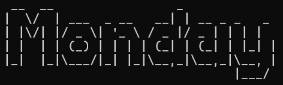

# Monday User Guide



Welcome to Monday, your personal task management assistant! With Monday, you can easily add, delete, find, and manage your tasks efficiently. This guide will walk you through the features and how to use them.


- [Quick Start](#Quick-Start)

- [Features](#features)
  - [Adding Todos](#adding-todos)  
  - [Adding Deadlines](#adding-deadlines)
  - [Adding Events](#adding-events)
  - [Deleting Tasks](#deleting-tasks)
  - [Listing All Tasks](#listing-all-tasks)
  - [Finding Tasks](#finding-tasks)
  - [Marking Tasks as Done](#marking-tasks-as-done)
  - [Unmarking Tasks](#unmarking-tasks)
  - [Exiting Monday](#exiting-monday)

## Quick Start

1. Ensure you have Java 17 or above installed in your Computer.


2. Download the latest .jar file from [here](https://github.com/lucas-sc0/ip/releases/tag/Monday-v0.2).


3. Copy the file to a folder.


4. Open a command terminal, cd into the folder you put the jar file in, and use the java -jar Monday.jar command to run the application.


5. Type the command in the command box and press Enter to execute it. 


6. Refer to the [Features](#features) below for details of each command.

## Features
Notes about the command format:
- Words in `<angle brackets>` are the parameters to be supplied by the user.
- In the example outputs below, `X` is just a placeholder to represent the number of tasks in the list.
- When running monday for the first time, `/data/monday.txt` will be generated in the same folder as monday.jar.
- Tasks that are subsequently added will be saved & loaded from `monday.txt`.

## Adding Todos

Add a todo task.

Example: `todo <description>`

You will receive confirmation that the todo task has been added.

```
    Added: [T][ ] <description>
    Now you have 2 tasks in the list.
```

## Adding Deadlines

Add a deadline task with a specific date and time.

Example: `deadline <description> /by <dd/MM/yyyy hhmm>`

You will see a confirmation message that the deadline has been added to your task list.

```
    Added: [D][ ] <description> (by: <date and time>)
    Now you have X tasks in the list.
```

## Adding Events

Add an event task with a specified start and end time.

Example: `event <description> /from <start time> /to <end time>`

You will see a message confirming that the event has been added.

```
    Added: [E][ ] <description> (from: <start time> to: <end time>)
    Now you have X tasks in the list.
```

## Deleting Tasks

Delete a specific task by its task number.

Example: `delete <task number>`

You will receive a confirmation that the task has been removed.

```
    Removed: [T][ ] <description>
    Now you have X tasks in the list.
```

## Listing All Tasks

Delete a specific task by its task number.

Example: `list`

The application will display all tasks along with their statuses.

```
    Here are your tasks:
    1.[T][ ] <description>
    2.[D][ ] <description> (by: <date and time>)
    3.[E][ ] <description> (from: <start time> to: <end time>)
```
## Finding Tasks

Search for tasks that contain a specific keyword.

Example: `find <keyword>`

The system will return all tasks matching the keyword only from description.

```
    Here are the matching tasks in your list:
    1.[D][ ] <description>
```
## Marking Tasks as Done

Mark a task as completed by its task number.

Example: `mark <task number>`

The task will be marked as done, and you will see a confirmation message.

```
    Nice! I've marked this task as done:
    [D][X] <description> (by: <date and time>)
```

## Unmarking Tasks

Unmark a task as incomplete by its task number.

Example: `unmark <task number>`

The task will be marked as not done, and you will see a confirmation message.

```
    OK, I've marked this task as not done:
    [D][ ] <description> (by: <date and time>)
```

## Exiting Monday

Exit the application.

Example: `bye`

The application will terminate, displaying a farewell message.

```
    Exiting the application. Goodbye!
```
