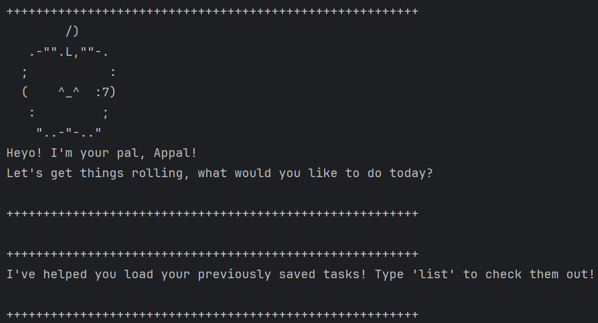

# Appal User Guide



Appal is your best pal with whom to track your tasks. such as your todos, deadlines and events, and you can access them
by listing the tasks or filtering the list to find specific tasks. For each Appal session, your task list will be saved
right into your laptop too!

## **Features**

> [!NOTE]
> Words in `UPPER_CASE` are the parameters to be supplied by the user.
e.g. in `todo TASK`, `TASK` is a parameter that requires the user's input, such as `todo homework`.

> [!NOTE]
> Tasks that are added to the task list in Appal are by default unmarked, and after each change to the task list,
> the task list is saved.

If the user has previously saved tasks from a previous session, Appal will load it up in the current session.
```
++++++++++++++++++++++++++++++++++++++++++++++++++++++++
I've helped you load your previously saved tasks! Type 'list' to check them out!

++++++++++++++++++++++++++++++++++++++++++++++++++++++++
```
> [!NOTE]
> Tasks that are added to the task list in Appal are by default unmarked.

## Adding todos: `todo`

Adds a todo task to the task list.

Format: `todo TASK`

Example input: `todo finish code`

Expected output:
```
++++++++++++++++++++++++++++++++++++++++++++++++++++++++
I've added the below to your to-do list, you can do it!
[T][ ] finish code

++++++++++++++++++++++++++++++++++++++++++++++++++++++++
```

## Adding deadlines: `deadline`

Adds a deadline task, with the deadline date in yyyy-mm-dd format, to the task list.

Format: `deadline TASK /by DEADLINE_DATE`

Example: `deadline assignment /by 2024-10-03`

Expected output:

```
++++++++++++++++++++++++++++++++++++++++++++++++++++++++
I've added the below to your to-do list, you can do it!
[D][ ] assignment(by: Oct 3 2024)

++++++++++++++++++++++++++++++++++++++++++++++++++++++++
```

## Adding events: `event`

Adds a event task, with its duration, to the task list.

Format: `event TASK /from START_TIME /to END_TIME`

Example: `event project meeting /from 3rd Oct 2024 2pm /to 4pm`

Expected output:

```
++++++++++++++++++++++++++++++++++++++++++++++++++++++++
I've added the below to your to-do list, you can do it!
[E][ ] project meeting(from: 3rd Oct 2024 2pm to: 4pm)

++++++++++++++++++++++++++++++++++++++++++++++++++++++++
```

## List out all tasks: `list`

Lists out all tasks the task list tracked by Appal.

Format: `list`

Expected output:

```
++++++++++++++++++++++++++++++++++++++++++++++++++++++++
You have 3 to-dos!
1.[T][ ] finish code
2.[D][ ] assignment(by: Oct 3 2024)
3.[E][ ] project meeting(from: 3rd Oct 2024 2pm to: 4pm)

++++++++++++++++++++++++++++++++++++++++++++++++++++++++
```

## Marking tasks: `mark`

Marks a specified task, by its index, in the task list.

Format: `mark TASK_INDEX`

Example: `mark 1`

Expected output:

```
++++++++++++++++++++++++++++++++++++++++++++++++++++++++
Task done! One more step towards success :)
[T][X] finish code

++++++++++++++++++++++++++++++++++++++++++++++++++++++++
```

## Unmarking tasks: `unmark`

Unmarks a specified task, by its index, in the task list.

Format: `unmark TASK_INDEX`

Example: `unmark 1`

Expected output:

```
++++++++++++++++++++++++++++++++++++++++++++++++++++++++
What's next on the agenda? :D
[T][ ] finish code

++++++++++++++++++++++++++++++++++++++++++++++++++++++++
```

## Deleting tasks: `delete`

Deletes a specified task, by its index, in the task list.

Format: `delete TASK_INDEX`

Example: `delete 3`

Expected output:

```
++++++++++++++++++++++++++++++++++++++++++++++++++++++++
The task below has been removed, it's always okay to change your mind!
[E][ ] project meeting(from: 3rd Oct 2024 2pm to: 4pm)

++++++++++++++++++++++++++++++++++++++++++++++++++++++++
```

## Finding tasks: `find`

Finds tasks in the task list that contains a user specified target string.

Format: `find TARGET_STRING`

Example: `find code`

Expected output:

```
++++++++++++++++++++++++++++++++++++++++++++++++++++++++
1.[T][ ] finish code

++++++++++++++++++++++++++++++++++++++++++++++++++++++++
These tasks match your search, pal!

++++++++++++++++++++++++++++++++++++++++++++++++++++++++
```

## Checking deadlines: `check`

Checks for deadlines that are due before or on a user specified date in the format yyyy-mm-dd.

Format: `check DEADLINE_DATE`

Example: `check 2024-10-10`

Expected output:

```
++++++++++++++++++++++++++++++++++++++++++++++++++++++++
1.[D][ ] assignment(by: Oct 3 2024)

++++++++++++++++++++++++++++++++++++++++++++++++++++++++
Here are the existing deadlines due before or on your specified date!

++++++++++++++++++++++++++++++++++++++++++++++++++++++++
```

## Exiting Appal: `bye`

Format: `bye`

Expected output:

```
++++++++++++++++++++++++++++++++++++++++++++++++++++++++
See ya! An Appal a day, keeps the boredom away!

++++++++++++++++++++++++++++++++++++++++++++++++++++++++
```
