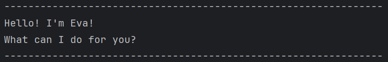

# Eva User Guide



Eva is a chatbot that would help users organise their daily tasks better. Users are able to add todo
tasks, deadline tasks and event tasks to their list of items to do. Allowing for better organisation
and planning. Users can also mark tasks as done or unmark tasks as done. If the task is no longer
relevant, users can delete the task. Lastly, users can use the find feature to search for specific 
tasks.

## Features

### 1. Todo

Allows users to add todos to their lists.

Format: ```todo [TASK_NAME]```

Example: todo homework

Expected outcome:
```
---------------------------------------------------------------
todo homework
Okay, I've added this todo: 
[T][ ] homework
Now you have 1 tasks in the list.
---------------------------------------------------------------
```

### 2. Deadline

Allows users to add deadlines to their lists. 
Deadlines are tasks that need to be done by a specific time.

Format: ```deadline [TASK_NAME] /by [DUE_TIME]```

Example: deadline exercise /by 9pm

Expected outcome:
```
---------------------------------------------------------------
deadline exercise /by 9pm
Okay, I've added this deadline: 
[D][ ] exercise (by: 9pm)
Now you have 2 tasks in the list.
---------------------------------------------------------------
```

### 3. Event

Allows users to add events to their lists.
Events tasks that start at a specific date/time and ends at a specific date/time.

Format: ```event [TASK_NAME] /from [START_TIME] /to [END_TIME]```

Example: event cs2113 tut /from 10am /to 11am

Expected outcome:
```
---------------------------------------------------------------
event cs2113 tut /from 10am /to 11am
Okay, I've added this event: 
[E][ ] cs2113 tut (from: 10am to: 11am)
Now you have 3 tasks in the list.
---------------------------------------------------------------
```

### 4. List

Display the tasks the user has in their list.

Format: ```list```

Expected outcome:
```
---------------------------------------------------------------
list
Here are the tasks in your list:
1. [T][ ] homework
2. [D][ ] exercise (by: 9pm)
3. [E][ ] cs2113 tut (from: 10am to: 11am)
---------------------------------------------------------------
```

### 5. Mark

Allows users to mark a specific task as done in the task list.

Format: ```mark [TASK_NUMBER]```

Example: mark 2

Expected outcome:
```
---------------------------------------------------------------
mark 2
Great! This task is marked as done: 
[D][X] exercise (by: 9pm)
Well done! ;)
---------------------------------------------------------------
```
In list:
```
---------------------------------------------------------------
list
Here are the tasks in your list:
1. [T][ ] homework
2. [D][X] exercise (by: 9pm)
3. [E][ ] cs2113 tut (from: 10am to: 11am)
---------------------------------------------------------------
```


### 6. Unmark

Allows users to unmark a specific task as done in the task list.

Format: ```unmark [TASK_NUMBER]```

Example: unmark 2

Expected outcome:
```
---------------------------------------------------------------
unmark 2
Ok, This task is marked as not done yet: 
[D][ ] exercise (by: 9pm)
---------------------------------------------------------------
```
In list:
```
---------------------------------------------------------------
list
Here are the tasks in your list:
1. [T][ ] homework
2. [D][ ] exercise (by: 9pm)
3. [E][ ] cs2113 tut (from: 10am to: 11am)
---------------------------------------------------------------
```


### 7. Delete

Allows users to delete a specific task in the task list.

Format: ```delete [TASK_NUMBER]```

Example: delete 3

Expected outcome:
```
---------------------------------------------------------------
delete 3
Okay. I have deleted task 3.
[E][ ] cs2113 tut (from: 10am to: 11am)
Now you have 2 tasks in the list.
---------------------------------------------------------------
```
In list:
```
---------------------------------------------------------------
list
Here are the tasks in your list:
1. [T][ ] homework
2. [D][ ] exercise (by: 9pm)
---------------------------------------------------------------
```

### 8. Find

Allows users to search for tasks using a keyword.

Format: ```find [KEYWORD]```

Example: find tut

Expected outcome:
```
---------------------------------------------------------------
find tut
Here are the matching tasks in your list:
1. [E][ ] cs2113 tut (from: 10am to: 11am)
2. [E][ ] cs1231 tut (from: 2pm to: 4pm)
---------------------------------------------------------------
```

### 9. Bye

Allows users to exit the program.

Format: ```bye```

Expected outcome:
```
---------------------------------------------------------------
bye
Bye. Hope to see you again soon!
---------------------------------------------------------------
```

