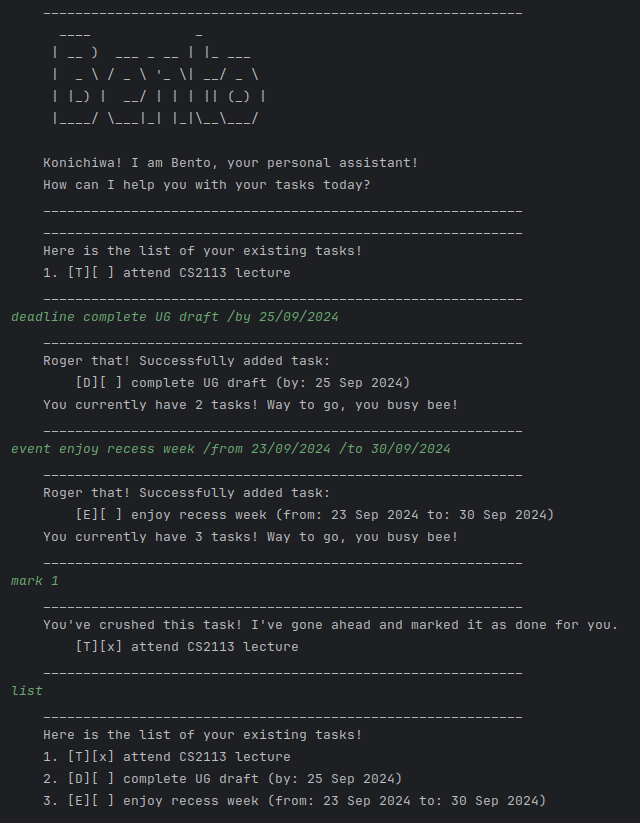

# Bento User Guide



Say konichiwa to Bento, your very own Japanese-inspired task management chatbot! Bento is able to accurately track your todos, deadlines and upcoming events. Bento is also able to save your work when you have to say sayonara but will remember your tasks so that you can continue right where you left off. Try out a Bento today!

## Ending the chat: `bye`

Terminates the chat with Bento. Bento will also save your tasks in `./data/save.txt`

Format: `bye`

Example output:
```
	____________________________________________________________
	Banzai! I've saved all our tasks for you to work on them next time!
	____________________________________________________________
	____________________________________________________________
	Thank you for working with me today! See you next time! Sayonara~
	____________________________________________________________
```

## Adding a ToDo: `todo`

Adds a ToDo to your list of tasks and saves it.

Format: `todo [TODO_NAME]`

Example output:
```
todo attend CS2113 lecture
	____________________________________________________________
	Roger that! Successfully added task:
		[T][ ] attend CS2113 lecture
	You currently have 4 tasks! Way to go, you busy bee!
	____________________________________________________________
```


## Adding a Deadline: `deadline`

Adds a Deadline to your list of tasks and saves it. Note that the due date of the deadline has to follow the format of `dd/MM/yyyy`.

Format: `deadline [DEADLINE_NAME] /by [DEADLINE_BY]`

Example output:
```
deadline complete UG draft /by 25/09/2024
	____________________________________________________________
	Roger that! Successfully added task:
		[D][ ] complete UG draft (by: 25 Sep 2024)
	You currently have 4 tasks! Way to go, you busy bee!
	____________________________________________________________
```

## Adding an Event: `event`

Adds an Event to your list of tasks and saves it. Note that the start and end dates of the event must follow the format of `dd/MM/yyyy`. Bento will also consider an event to be invalid if the end date is earlier than the start date.

Format: `event [EVENT_NAME] /from [FROM_DATE] /to [TO_DATE]`

Example output:
```
event enjoy recess week /from 23/09/2024 /to 30/09/2024
	____________________________________________________________
	Roger that! Successfully added task:
		[E][ ] enjoy recess week (from: 23 Sep 2024 to: 30 Sep 2024)
	You currently have 4 tasks! Way to go, you busy bee!
	____________________________________________________________
event enjoy recess week /from 30/09/2024 /to 23/09/2024
	____________________________________________________________
	Hmm... That doesn't seem quite right. Try "event [EVENT_NAME] /from [FROM] /to [TO]" instead!
	____________________________________________________________
```

## Listing Tasks: `list`

Bento will list and display all your tasks (ToDos, Deadlines and Events) along with additional information such as their completion status.

Format: `list`

Example output:
```
list
	____________________________________________________________
	Here is the list of your existing tasks!
	1. [T][x] attend CS2113 lecture
	2. [D][ ] complete UG draft (by: 25 Sep 2024)
	3. [E][ ] enjoy recess week (from: 23 Sep 2024 to: 30 Sep 2024)
	____________________________________________________________
```

## Showing Deadlines and Events by Date: `show`

Bento will search for and display Deadlines and Events with the relevant search date. The search date must follow the format of `dd/MM/yyyy`.

Format: `show [SEARCH_DATE]`

Example output:
```
list
	____________________________________________________________
	Here is the list of your existing tasks!
	1. [D][ ] read book (by: 01 Jan 2024)
	2. [E][ ] return book (from: 01 Jan 2024 to: 02 Jan 2024)
	____________________________________________________________
show 01/01/2024
	____________________________________________________________
	Here are your tasks of interest!
	1. [D][ ] read book (by: 01 Jan 2024)
	2. [E][ ] return book (from: 01 Jan 2024 to: 02 Jan 2024)
	____________________________________________________________
show 02/01/2024
	____________________________________________________________
	Here are your tasks of interest!
	1. [E][ ] return book (from: 01 Jan 2024 to: 02 Jan 2024)
	____________________________________________________________
```

## Finding Tasks: `find`

Bento will look for tasks whose description match the search phrase and display them.

Format: `find [SEARCH_PHRASE]`

Example output:
```
list
	____________________________________________________________
	Here is the list of your existing tasks!
	1. [D][ ] read book (by: 01 Jan 2024)
	2. [E][ ] return book (from: 01 Jan 2024 to: 02 Jan 2024)
	3. [T][x] eat dinner
	____________________________________________________________
find book
	____________________________________________________________
	Here are your tasks of interest!
	1. [D][ ] read book (by: 01 Jan 2024)
	2. [E][ ] return book (from: 01 Jan 2024 to: 02 Jan 2024)
	____________________________________________________________
find read
	____________________________________________________________
	Here are your tasks of interest!
	1. [D][ ] read book (by: 01 Jan 2024)
	____________________________________________________________
find dinner
	____________________________________________________________
	Here are your tasks of interest!
	1. [T][x] eat dinner
	____________________________________________________________
```

## Marking Tasks as Complete: `mark`

Bento will mark the task associated with the provided index as completed and display it to the user

Format: `mark [TASK_INDEX]`

Example output:
```
list
	____________________________________________________________
	Here is the list of your existing tasks!
	1. [D][ ] read book (by: 01 Jan 2024)
	2. [E][ ] return book (from: 01 Jan 2024 to: 02 Jan 2024)
	3. [T][ ] eat dinner
	____________________________________________________________
mark 3
	____________________________________________________________
	You've crushed this task! I've gone ahead and marked it as done for you.
		[T][x] eat dinner
	____________________________________________________________
```

## Unmarking Tasks as Incomplete: `unmark`

Bento will unmark the task associated with the provided index as incomplete and display it to the user.

Format: `unmark [TASK_INDEX]`

Example output:
```
unmark 3
	____________________________________________________________
	Maybe you're not quite ready for the task just yet. No worries, I'll be here to make sure you clear it.
		[T][ ] eat dinner
	____________________________________________________________
```

## Deleting Tasks: `delete`

Bento deletes the task associated with the provided index.

Format: `delete [TASK_INDEX]`

Example output:
```
list
	____________________________________________________________
	Here is the list of your existing tasks!
	1. [D][ ] read book (by: 01 Jan 2024)
	2. [E][ ] return book (from: 01 Jan 2024 to: 02 Jan 2024)
	3. [T][ ] eat dinner
	____________________________________________________________
delete 3
	____________________________________________________________
	The following task has been removed successfully:
		[T][ ] eat dinner
	You currently have 2 tasks! Way to go, you busy bee!
	____________________________________________________________
list
	____________________________________________________________
	Here is the list of your existing tasks!
	1. [D][ ] read book (by: 01 Jan 2024)
	2. [E][ ] return book (from: 01 Jan 2024 to: 02 Jan 2024)
	____________________________________________________________
```