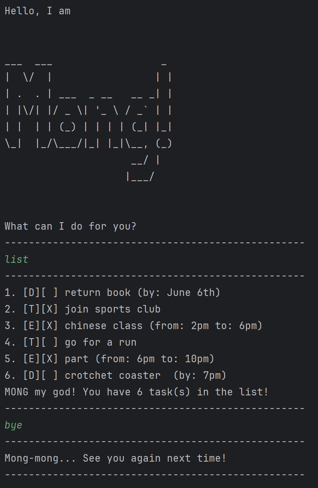

# Mong User Guide



Mong is a virtual assistant inspired by Nyan, a Ragdoll cat. Get ready to be mong-ed!

## Getting started
Download cs2113-ip.jar from release v0.2. 
In the terminal, navigate to the folder where the .jar fine is located.
Run the .jar file from your terminal.

Format: `java -jar cs2113-ip.jar`

Mong is ready for you to use!

## Adding todos: ```todo```

Add a Task of type Todo.
* A todo consists of the task description only.

Example: `todo buy cabbage`

```
Mong-ed! This item has been added: 
[T][ ] buy cabbage
```

## Adding deadlines: ```deadline```

Add a Task of type Deadline.
* A deadline consists of the task description and deadline in String format.

Example: `deadline homework /by tuesday`

```
Mong-ed! This item has been added: 
[D][ ] homework  (by: tuesday)
```

## Adding events: ```event```

Add a Task of type Event.
* An event consists of the task description and from/to period in String format.

Example: `event chinese class /from 2pm /to 6pm`

```
Mong-ed! This item has been added: 
[E][ ] chinese class (from: 2pm to: 6pm)
```
## Finding Tasks: ```find```

Find the tasks with the relevant keyword and displays them in a list
* This feature currently only supports single keyword inputs.

Example: `find run`

```
MO-ongong! Is this what you were looking for?
1. [T][ ] go for a run
```
## Marking Tasks: ```mark```

Sets the task corresponding to its position in the list as completed.

Example: `mark 1`

```
list
--------------------------------------------------
1. [D][ ] return book (by: June 6th)
2. [T][X] join sports club
3. [E][X] chinese class (from: 2pm to: 6pm)
4. [T][ ] go for a run
5. [E][X] part (from: 6pm to: 10pm)
6. [D][ ] crotchet coaster  (by: 7pm)
7. [D][ ] homework  (by: tuesay)
8. [T][ ] buy cabbage
MONG my god! You have 8 task(s) in the list!
--------------------------------------------------
mark 1
--------------------------------------------------
Mong >_<!!I have marked it as completed:
[D][X] return book (by: June 6th)
--------------------------------------------------
```

## Unmarking Tasks: ```mark```

Sets the task corresponding to its position in the list as uncompleted.

Example: `unmark 1`

```
list
--------------------------------------------------
1. [D][X] return book (by: June 6th)
2. [T][X] join sports club
3. [E][X] chinese class (from: 2pm to: 6pm)
4. [T][ ] go for a run
5. [E][X] part (from: 6pm to: 10pm)
6. [D][ ] crotchet coaster  (by: 7pm)
7. [D][ ] homework  (by: tuesay)
8. [T][ ] buy cabbage
MONG my god! You have 8 task(s) in the list!
--------------------------------------------------
unmark 1
--------------------------------------------------
Mong-mong :<! The task has been unmarked:
[D][ ] return book (by: June 6th)
--------------------------------------------------
```

## Deleting Tasks: ```delete```

Deletes the task corresponding to its position in the list.

Example: `delete 1`

```
Mong-?!@# This item has been removed: 
[D][ ] return book (by: June 6th)
```

