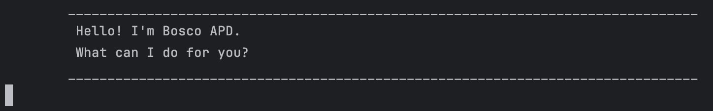

# Bosco User Guide



Bosco is a helpful CLI task manager, ready to assist you with tracking your todos, deadlines and events.

---

## Quick Start

1. Ensure that you have Java 17 installed on your computer.
2. Download the latest `Bosco.jar` file from [here]().
3. Move the file to the folder you want to use as the home folder for the application.
4. Open the terminal, `cd` into the folder containing `Bosco.jar`, and use the `java -jar Bosco.jar` 
   command to start the application.
5. Type commands on the command line and press Enter to execute them.
6. Refer to list of [Features](#Features) below for details of each command.

---

## Features

### Adding a Todo task: `todo`

Adds a **Todo** to the list of tasks.

Format: `todo DESCRIPTION`

Example: `todo math homework`  
Output:
```
	________________________________________________________________________________
	 Got it. I've added this task:
	   [T][ ] math homework
	 Now you have 1 tasks in the list.
	________________________________________________________________________________

```

### Adding a Deadline task: `deadline`

Adds a **Deadline** to the list of tasks.

Format: `deadline DESCRIPTION /by DEADLINE`

Example: `deadline assignment 4 /by 11/10/2024`  
Output:
```
	________________________________________________________________________________
	 Got it. I've added this task:
	   [D][ ] assignment 4 (by: Oct 11 2024 11.59pm)
	 Now you have 2 tasks in the list.
	________________________________________________________________________________
```

### Adding an Event task: `event`

Adds an **Event** to the list of tasks.

Format: `event DESCRIPTION /from START /to END`

Example: `event math midterm /from 10-12-2024 13:00 /to 10-12-2024 14:00`  
Output:
```
	________________________________________________________________________________
	 Got it. I've added this task:
	   [E][ ] math midterm (from: Oct 12 2024 1.00pm to: Oct 12 2024 2.00pm)
	 Now you have 3 tasks in the list.
	________________________________________________________________________________
```

### Marking a task as done: `mark`

Marks the task at the specified list index as **done**.

Format: `mark INDEX`

Example: `mark 2` marks the second task in the list.  
Output: 
```
	________________________________________________________________________________
	 Nice! I've marked this task as done:
	   [D][X] assignment 4 (by: Oct 11 2024 11.59pm)
	________________________________________________________________________________
```

### Unmarking a task as not done: `unmark`

Sets the task at the specified list index to **not done**.

Format: `unmark INDEX`

Example: `unmark 1` unmarks the first task in the list.  
Output:
```
	________________________________________________________________________________
	 OK, I've marked this task as not done yet:
	   [T][ ] math homework
	________________________________________________________________________________
```

### Listing all tasks: `list`

Lists all tasks in the task list.

Format: `list`

Example output:
```
	________________________________________________________________________________
	 Here are the tasks in your list:
	 1.[T][ ] math homework
	 2.[D][X] assignment 4 (by: Oct 11 2024 11.59pm)
	 3.[E][ ] math midterm (from: Oct 12 2024 1.00pm to: Oct 12 2024 2.00pm)
	________________________________________________________________________________
```

### Finding tasks with keyword: `find`

Finds tasks with descriptions containing the specified keyword.

Format: `find KEYWORD`

Example: `find math`  
Output:
```
	________________________________________________________________________________
	 Here are the matching tasks in your list:
	 1.[T][ ] math homework
	 3.[E][ ] math midterm (from: Oct 12 2024 1.00pm to: Oct 12 2024 2.00pm)
	________________________________________________________________________________
```

### Deleting a task: `delete`

Deletes the task at the specified list index.

Format: `delete INDEX`

Example: `delete 3` deletes the third task in the list.  
Output:
```
	________________________________________________________________________________
	 Noted. I've removed this task:
	   [E][ ] math midterm (from: Oct 12 2024 1.00pm to: Oct 12 2024 2.00pm)
	 Now you have 2 tasks in the list.
	________________________________________________________________________________

```

### Exiting the program: `bye`

Exits the Bosco program.

Format: `bye`

Output:
```
	________________________________________________________________________________
	 Bye! Hope to see you again soon!
	________________________________________________________________________________
```

### Saving the data

Task list data is saved as a text file `[JAR file location]/data/bosco.txt`,
and updated automatically after each command execution.

During program startup, Bosco will check for the existence of the data file
in the `/data` directory.  
If the directory and file exists, Bosco will read 
from it and load the saved tasks. If not, it will create the directory and 
an empty file.
