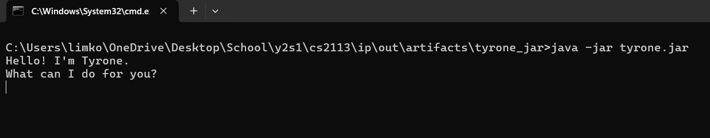
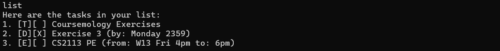
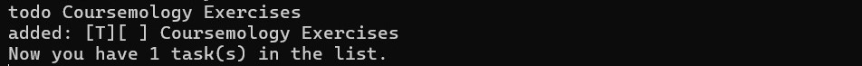
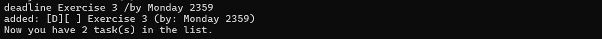
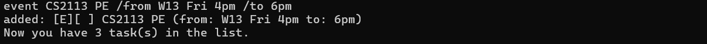
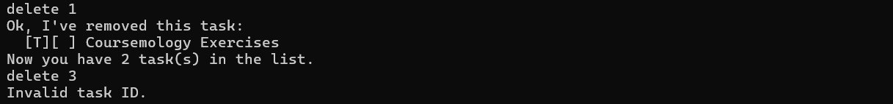
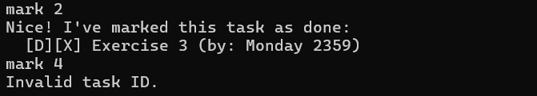
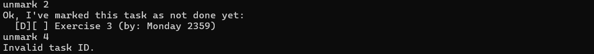
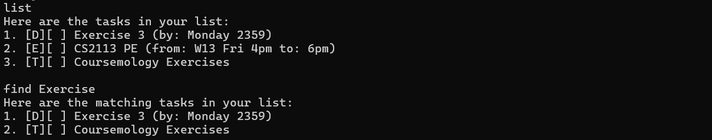
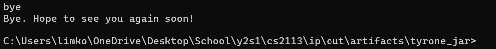

# Tyrone the Terrific Task Tracker

Tyrone the Terrific Task Tracker is a CLI-based desktop app for tracking 
tasks which helps users remember all the tasks they need to get done. 
***
## Quick Start

1. Ensure you have Java `17` or above installed in your Computer.
2. Download the latest `.jar` file from here.
3. Copy the file to the folder you want to use as the home folder for your Task Tracker.
4. Open a command terminal, cd into the folder you put the jar file in, and use the 
`java -jar tyrone.jar` command to run the application.

    Your command terminal should show the following:

   
5. Type the command in the command terminal and press Enter to execute it. 

    Some example commands you can try:

    * `list`: List all tasks currently saved by the task tracker.
    * `deadline Assignment 3 /by Monday 2359`: Adds a `Deadline` type task marked as not done
with description `Assignment 3` and deadline `Monday 2359` to the task tracker.
    * `delete 2`: Deletes the 2nd task listed in the task tracker's record of tasks.
    * `bye`: Exits the app.
6. Refer to the Features below for details of each command.
***
## Features
### Listing Tasks: `list`

Displays the task tracker's task list, a list which contains all tasks 
currently recorded by the task tracker.

Format: `list`

### Adding Tasks: `todo` / `deadline` / `event`

Adds a task to the task tracker. Tasks can be of one of 3 types: 
a `Todo`, `Deadline` or `Event`.
Upon adding the task, the task tracker will also show the number of tasks in the task list.

Format:
* Add `Todo`: `todo DESCRIPTION`
* Add `Deadline`: `deadline DESCRIPTION /by DEADLINE`
* Add `Event`: `event DESCRIPTION /from START_TIME /to END_TIME`

Examples: 
* `todo Coursemology Exercises`: Adds a `Todo` task to the task
tracker with description `Coursemology Exercises`.
* `deadline Assignment 3 /by Monday 2359`: Adds a `Deadline` type task marked as not done
with description `Assignment 3` and deadline `Monday 2359` to the task tracker.
* `event CS2113 PE /from W13 Fri 4pm /to 6pm`: Adds a `Event` type task marked as not done
  with description `CS2113 PE`, start time `W13 Fri 4pm` and end time `6pm` to the task tracker.

### Deleting Tasks: `delete`

Deletes a task from the task list. Upon adding the task, the task tracker will also show
the number of tasks in the task list.

Format: `delete INDEX`
* Deletes the person at the specified INDEX.
* The index refers to the index of the task in the task list.
* The index **must be a positive integer**, and must be the index of an existing task in
the task list ( i.e. index must be smaller than or equal to current size of task list.)

Examples:
* `delete 2`: Deletes the 2nd task in the task list (Assuming task tracker has at least 2 tasks).
If task tracker has less than 2 tasks, task tracker will inform user that the entered task index is invalid.

### Mark/Unmark Tasks: `mark` / `unmark`

Marks a task from the task list as done or not done.

Format: `mark INDEX` / `unmark INDEX`
* `mark INDEX` marks the task at specified `INDEX` as done, while `unmark INDEX` marks 
the task at the specified `INDEX` as not done.
* The index refers to the index of the task in the task list.
* The index **must be a positive integer**, and must be the index of an existing task in
  the task list ( i.e. index must be smaller than or equal to current size of task list.)

Examples:
* `mark 2`: Marks the 2nd task in the task list as done (Assuming task tracker has at least 2 tasks).
  If task tracker has less than 2 tasks, task tracker will inform user that the entered task index is invalid.
* `unmark 2`: Marks the 2nd task in the task list as not done (Assuming task tracker has at least 2 tasks).
  If task tracker has less than 2 tasks, task tracker will inform user that the entered task index is invalid.

### Search for Tasks by Description: `find`

Returns a list of all tasks with description containing the given keyword.

Format: `find KEYWORD`
* Lists all tasks which description contains KEYWORD as a substring within it.

Example:
* `find book` returns tasks `read book` and `book club`.

### Exiting the program: `bye`
Exits the program.

Format: `bye`

### Saving the data
Tyrone saves data in the hard disk automatically after any command that changes the task list.
There is no need to save manually.

***

## Command Summary

| **Command**                 | **Format & Examples**                                                                                                     |
|-----------------------------|---------------------------------------------------------------------------------------------------------------------------|
| **Listing Tasks**            | `list`                                                                                                                   |
| **Adding Todo Task**         | `todo DESCRIPTION`   e.g. `todo Coursemology Exercises`                                                            |
| **Adding Deadline Task**     | `deadline DESCRIPTION /by DEADLINE`   e.g. `deadline Assignment 3 /by Monday 2359`                                  |
| **Adding Event Task**        | `event DESCRIPTION /from START_TIME /to END_TIME`   e.g. `event CS2113 PE /from W13 Fri 4pm /to 6pm`               |
| **Deleting Task**            | `delete INDEX`   e.g. `delete 2`                                                                                   |
| **Marking Task as Done**     | `mark INDEX`   e.g. `mark 2`                                                                                       |
| **Unmarking Task as Not Done** | `unmark INDEX`   e.g. `unmark 2`                                                                                 |
| **Finding Tasks by Keyword** | `find KEYWORD`   e.g. `find book`                                                                                  |
| **Exiting Program**          | `bye`                                                                                                                    |

