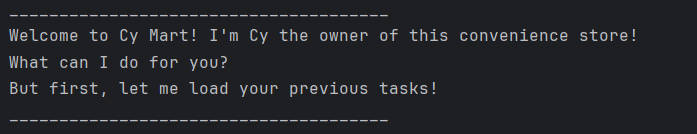

# Cy User Guide



Cy is your personal assistant, working in a convenience store called Cy Mart! 
She helps users to organise your daily tasks, from todos to deadlines and events. 
Users could mark and unmark tasks to indicate their state of completion. 
Additional functionalities such as delete, list and filter allows for greater organisation. 
Last but not least, user's task list would be stored locally after a session and will be restored in the next session.

# Features
> NOTE: Words in UPPER_CASE are the parameters to be supplied by the user.
  e.g. in todo DESCRIPTION, DESCRIPTION is a parameter which can be used as `todo cs2113 quiz`

> NOTE: After every command, the changes to the task list would be reflected in the local txt file immediately. 

## Adding Todos: `todo`

Adds tasks without any date or time attached to it.

Format: `todo n/DESCRIPTION`

Example: `todo read book`

Expected output:
```
______________________________________
Got it! I've added this task to your grocery list: 
[T][ ] read book
Now you have 1 tasks in the list
______________________________________
```

## Adding Deadlines: `deadline`

Add tasks that needs to be completed before a specific deadline.

Format: `deadline DESCRIPTION /by DEADLINE`

Example: `deadline cs2113 quiz /by 2024-11-11`

Expected output: 
```
______________________________________
Got it. I've added this deadline to your grocery list: 
[D][ ] cs2113 quiz (by:2024-11-11)
Now you have 2 tasks in the list
______________________________________
```
## Adding Events: `event`

Add tasks that starts and ends at a specific date/time.

Format: `event DESCRIPTION /from START /to END`

Example: `event cs2113 meeting /from 2pm /to 4pm`

Expected output: 
```
______________________________________
Got it. I've added this event to your grocery list: 
[E][ ] cs2113 meeting(from: 2pm to: 4pm)
Now you have 3 tasks in the list
______________________________________
```

## List Tasks: `list`

Prints out all the tasks in your list from both existing and previous sessions.

Format: `list`

Expected output: 
```
______________________________________
Here are the tasks in your grocery list
1.[T][ ] read book
2.[D][ ] cs2113 quiz
3.[E][ ] cs2113 meeting
______________________________________
```
## Mark as Done: `mark`

Mark completed task as _done_ by indicating its index.

Format: `mark INDEX`

Example: `mark 1`

Expected output: 
```
______________________________________
Check! One task off your grocery list!
[T][X] read book
______________________________________
```

## Unmark as Incomplete: `unmark`
Unmark completed task as _incomplete_ by indicating its index.

Format: `unmark INDEX`

Example: `unmark 1`

Expected output:
```
______________________________________
Here you go! One more item in your grocery list!
[T][ ] read book
______________________________________
```
## Delete Tasks: `delete`

Delete tasks from the list by indicating its index.

Format: `delete INDEX`

Example: `delete 3`

Expected output:
```
______________________________________
Yipee! I have deleted this task, one item off your grocery list!
[E][ ] cs2113 meeting
______________________________________
```

## Find Tasks: `find`

Find task by searching for a keyword

Format: `find KEYWORD`

Example: `find cs2113`

Expected output:
```
______________________________________
Here are the similar tasks in your grocery list
1. [D][ ] cs2113 quiz (by:2024-11-11)
______________________________________
```

## Exit the program: `bye`

Exits the program

Format: `bye`

Expected output: 
```
______________________________________
Thanks for visiting Cy Mart! Have a nice day :)
______________________________________
```