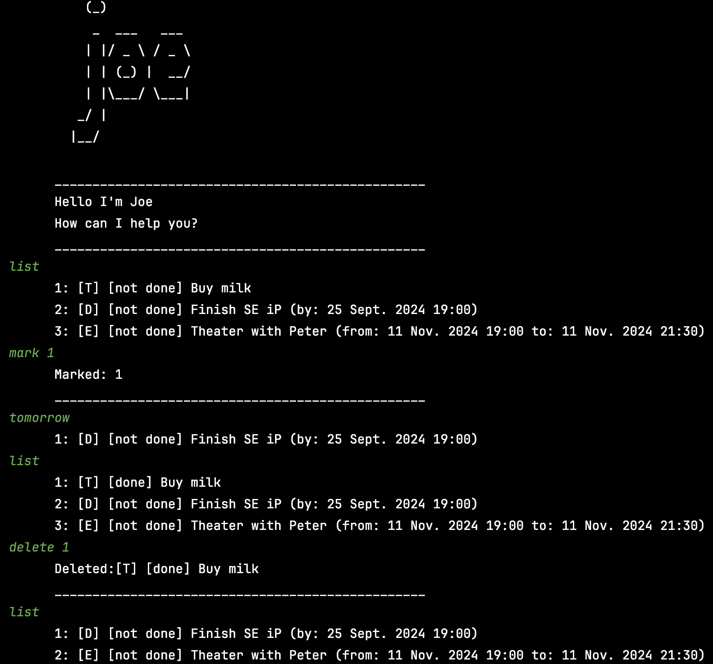

# Joe User Guide

Joe is a minimalistic CLI application for you to manage your daily tasks. 
It allows for creating, marking/unmarking and deleting todos, deadlines (todos with a deadline date) and events (todos with a time range).
Aside from helping you to track these tasks, the app also helps you retain a birdseye view of what you need to do.
The following lines show you how to use it. 

## Saving the current list state and closing the application
Execute the following command:
```
bye
```

## Adding items to the list
### Adding todos
Use the `todo` command and write in the todo description. 

For example, you can input:
```
todo buy milk
```
The expected output:
```
Added: buy milk
_________________________________________________
```
The todo will be stored as `[T] [not done] buy milk]`.

### Adding deadlines
Use the `deadline` command, followed by the deadline's description and its due date after the `/by` command.
The deadline date can be of either of the following format:
- `today` (defaults to today at 23:59🕔)
- `tomorrow` (defaults to tomorrow at 23:59🕔)
- `today/tomorrow HHmm` (e.g. today 1900)
- `HHmm` (e.g. 1030, defaults to today at 10:30🕥)
- `YYYY-MM-DD` (e.g. 2024-11-11, defaults to 2024-11-11 at 23:59🕔)
- `YYYY-MM-DD HHmm` (e.g. 2024-11-11 10:30)
  
For example, you can input:
```
deadline fix bug /by tomorrow 1100
```
The expected output:
```
Added: fix bug 
_________________________________________________
```
The respective deadline task is then stored as `[D] [not done] fix bug  (by: 25 Sept. 2024 11:00)`.

### Adding events
Use the `event` command, followed by the event's description and a time range indicated by the `/from` (for the start date) and `/to` (for the end date) command.
The provided start and end date after the '/from' and '/to' commands can be of either of the following format:
- `today` (defaults to today at 23:59🕔)
- `tomorrow` (defaults to tomorrow at 23:59🕔)
- `today/tomorrow HHmm` (e.g. today 1900)
- `HHmm` (e.g. 1030, defaults to today at 10:30🕥)
- `YYYY-MM-DD` (e.g. 2024-11-11, defaults to 2024-11-11 at 23:59🕔)
- `YYYY-MM-DD HHmm` (e.g. 2024-11-11 10:30)
  
For example, you can input:
```
event Theater with Peter and Barbara /from tomorrow 2000 /to tomorrow 2300
```
The expected output:
```
Added: Theater with Peter and Barbara 
_________________________________________________
```
The respective deadline task is then stored as `[E] [not done] Theater with Peter and Barbara  (from: 25 Sept. 2024 20:00 to: 25 Sept. 2024 23:00)`.

## Deleting items from the list
Use the `delete` command followed by the index of the task you want to delete in the full task list (viewable with the `list` command.
For example, consider this to be your list of tasks in which you recognise that the Theater event is duplicated:
```
list
      1: [T] [not done] Buy milk
      2: [D] [not done] Finish SE iP (by: 25 Sept. 2024 19:00)
      3: [E] [not done] Theater with Peter and Barbara  (from: 25 Sept. 2024 20:00 to: 25 Sept. 2024 23:00)
      4: [D] [not done] fix bug  (by: 25 Sept. 2024 11:00)
      5: [E] [not done] Theater with Peter and Barbara  (from: 25 Sept. 2024 20:00 to: 25 Sept. 2024 23:00)
```
To delete the 5th entry you simply input the following command:
```
delete 5
```
Notice that the delete option works for any task item. No matter if it is an event, todo or deadline. 
Warning: The provided index to delete needs to fit the index of the desired item in the list of tasks printed out after executing the list command. 
Indices are updated after deleting items. Therefore, we advice to always use the `list` command previous to deleting an item. 


## Getting an overview of tasks in the list
### Showing all tasks
Execute the following
```
list
```

### Showing deadlines and events due by the end of today
Execute the following 
```
today
```

### Showing deadlines and events due before or by the end of tomorrow
```
tomorrow
```

## Marking and unmarking tasks as `done` and `not done`
At creation, every task is created as `not done`. 
### Marking
To mark a task as done execute the `mark` command together with the index of the item whose status you want to modify.
For example, consider this to be your list of tasks in which you recognise that the Theater event is duplicated:
```
list
      1: [T] [not done] Buy milk
      2: [D] [not done] Finish SE iP (by: 25 Sept. 2024 19:00)
      3: [E] [not done] Theater with Peter and Barbara  (from: 25 Sept. 2024 20:00 to: 25 Sept. 2024 23:00)
      4: [D] [not done] fix bug  (by: 25 Sept. 2024 11:00)
```
To mark the task "Finish SE iP" as done execute:
```
mark 2
```

### Unmarking
To unmark a task execute the `unmark` command together with the index of the item whose status you want to modify.
Consider the example from above. If you want to set the status of item 2 to 'not done' again, execute:
```
unmark 2
```
