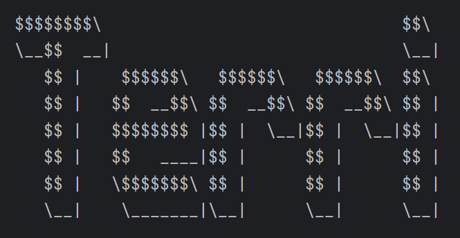

# Terri User Guide

Terri is a personal task management program, designed to aid users in keeping track of upcoming deadlines and events. 

It is intended for use via the Command Line Interface (CLI).

## Quick Start

1. Ensure you have `Java 17` installed on your Computer.
2. Download the latest `.jar` file from the releases page, [here].
3. Copy the `terri.jar` file to the desired folder.
4. Open a command terminal, `cd` into the folder with the `.jar` file
   and use `java -jar terri.jar` command to run the application.

## Feature Summary
Please note that all described commands/inputs are case-agnostic.

| Command      | Format                                                            |
|--------------|-------------------------------------------------------------------|
| Add ToDo     | `todo {description}`                                              |
| Add Deadline | `deadline {description} /by {deadline}`                           |
| Add Event    | `event {description} /from {start time} /to {end time}` |
| List         | `list`                                                            |
| Mark         | `mark {task index}`                                               |
| Unmark       | `unmark {task index}`                                             |
| Delete       | `delete {task index}`                                             |

## Adding Tasks
### Add ToDo: `todo`

Adds a task with only a task description and no set deadline or duration. 

| Command | Format                                                            |
|--------|-------------------------------------------------------------------|
| `todo` | `todo {description}` 

Example: `todo wash clothes` Adds a todo task with description `wash clothes`.

Terri will respond with confirmation of the task addition, a description of the added task, and an updated
number of current tasks.

### Add Deadline: `deadline`

Adds a task with a task description and set deadline. 

| Command    | Format                                                            |
|------------|-------------------------------------------------------------------|
| `deadline` | `deadline {description} /by {dd/MM/yyyy HHmm}` 

Example: `deadline Create Terri /by 1/11/2024 2000` will add a deadline task with description `Create Terri`, 
whose deadline is `8pm` on `15/10/2024`.

Terri will respond with confirmation of the deadline addition, a description of the added task, and an updated
number of current tasks.

### Add Event: `event`

Adds a task with a task description and set duration. 

| Command | Format                                                            |
|---------|-------------------------------------------------------------------|
| `event` | `event {description} /from {dd/MM/yyyy HHmm} /to {dd/MM/yyyy HHmm}` 

Example: `event Attend Terri Launch Party /from 2/1/2024 1800 /to 3/1/2024 0300` will add an event-type task with
description `Attend Terri Launch Party`, beginning at `6pm` on `2/1/2024` and continuing until `3am` on `3/1/2024`.

Terri will respond with confirmation of the event addition, a description of the added event, and an updated
number of current tasks.

## Listing tasks: `list`

Lists all tasks (todos/deadlines/events) currently being managed by Terri, in order of recency of addition. All 
relevant details (i.e. descriptions, start times and end time) will be included, as applicable.

The number presented next to each task is it's `task index`. This number will is used for marking, unmarking, and 
deleting tasks.

| Command | Format                                                            |
|---------|-------------------------------------------------------------------|
| `list`  | `list` 

## Marking Tasks

Please note the following symbols that are used by Terri to indicate task completion.

| Symbol | Meaning |
|--------|---------|
| `[X]`  | Task is completed
| `[ ]`  | Task is not completed

NOTE: `{task index}` can be found with `list` command.

### Mark: `mark`

Marks the designated task as complete.

| Command | Format                                                            |
|--------|-------------------------------------------------------------------|
| `mark`  | `mark {task index}`

Example: `mark 4` will marks the 4th task in `list` as done.

Terri will respond with details of the updated task, along with it's new complete status.

### Unmark: `unmark`

Marks the designated task as incomplete.

| Command | Format                                                            |
|--------|-------------------------------------------------------------------|
| `mark`  | `mark {task index}`

Example: `unmark 4` Marks the 4th task in `list` as not done.

Terri will respond with details of the updated task, along with it's new incomplete status.

## Delete Tasks: `delete`

Deletes the specified task from Terri.

| Command  | Format                                                            |
|----------|-------------------------------------------------------------------|
| `delete` | `delete {task index}`

Example: `delete 4` Deletes the task corresponding to index `4` when `list` is called.

Terri will respond with confirmation of the details of the deleted task, and the updated number of current tasks

## Exit Terri: `bye`

| Command | Format                                                            |
|---------|-------------------------------------------------------------------|
| `bye`   | `bye`

Exits the Terri Chatbot. All of your data is persistent, unless otherwise modified on disk.

## Data Saving

Terri tasks are saved to the disk automatically after any command that would affect the status/contents of a 
managed task (i.e. adding a task, marking it completed, deleting a task, etc).

Terri tasks are saved as a `.txt` file. 

Filepath: `[JAR file location]/data/terri.txt` 

If desired, you may manually update stored data by directly editing the file. 

All stored data is given in the format: `{task type} | {completeion status} | {description} | {date/time 1} | 
{date/time 2}` .

If the indicated task type does not require a value (i.e. `todo` tasks do not require start/end times), the field will 
be blank.

1. Task Type is indicated as below:

| Symbol | Event Type                                                            |
|--------|-------------------------------------------------------------------|
| `[T]`  | Todo
| `[D]`  | Deadline
| `[E]`  | Event

2. Completion status is indicated as below:

| Symbol | Meaning |
|--------|---------|
| `[X]`  | Task is completed
| `[ ]`  | Task is not completed

3. Description is given in plaintext.

`date/time 1`: In `dd MMM yyyy HHmm` format. This value represents the due-date for `deadline` type-tasks, and the 
start time for `event` type tasks 

`date/time 2`: In `dd MMM yyyy HHmm` format. This value represents the end-time for `event` type tasks.

