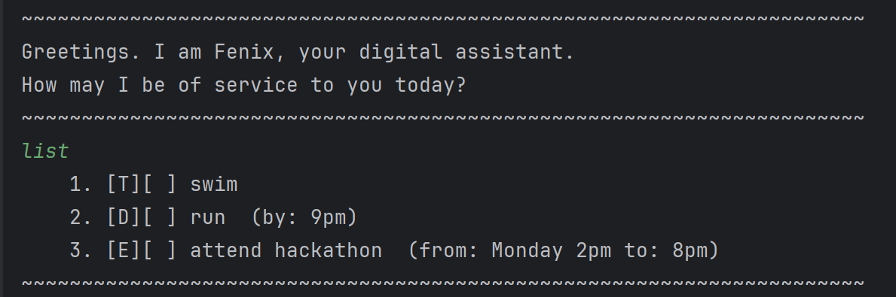

# Echo User Guide

## Product Screenshot:


## Product intro:
This project is part of CS2113 iP component. The project
is about a chatbot called Echo. He is a Task management
chatbot that is able to keep track of different tasks,
mark them as done or undone and even delete the tasks.
When user enters and leaves the CLI, Echo will also load
and save the contents where appropriate.

## Adding deadlines

Allow users to key in deadline task description along with the due date
(due date is accepted only in 3 formats: 
yyyy-MM-dd, d/M/yyyy, and MMM dd yyyy)
and outputs by adding it into the list

Example: `deadline return book /by 2/12/2019` or `deadline return book /by Dec 02 2019`
or `deadline return book /by 2019-12-02`

Description of expected output:
```
______________________________
deadline return book /by 2019-12-02
______________________________
Got it. I've added this task:
[D] [ ] return book (by: Dec 12 2019)
Now you have 7 tasks in the list.
______________________________
```

## Adding todo

Allow users to key in a todo task description and outputs by adding it into the list

Example: `todo Joe`

Description of expected output:
```
______________________________
todo Joe
______________________________
Got it. I've added this task:
[T] [ ] Joe
Now you have 8 tasks in the list.
______________________________
```

## Adding event

Allow users to key in an event task description with the start time and end time
and outputs by adding it into the list

Example: `event lecture /from 4pm /to 6pm`

Description of expected output:
```
______________________________
event lecture /from 4pm /to 6pm
______________________________
Got it. I've added this task:
[E] [ ] lecture (from: 4pm to: 6pm)
Now you have 9 tasks in the list.
______________________________
```

## List task

// Describe the action and its outcome.

// Give examples of usage

Example: `keyword (optional arguments)`

// A description of the expected outcome goes here

```
expected output
```

## Deleting task

Allow users to input index of task to be removed from the list and update the
new total number of task in the list

Example: `delete 4`

```
______________________________
Here are the tasks in your list:
1. [T] [X] Joe
2. [E] [ ] lecture (from: 4pm to: 6pm)
3. [D] [ ] return book (by: Dec 02 2019)
4. [T] [X] finding books

______________________________
delete 4
______________________________
Noted. I've removed this task:
[T] [X] finding books
Now you have 3 tasks in the list.
______________________________
list
______________________________
Here are the tasks in your list:
1. [T] [X] Joe
2. [E] [ ] lecture (from: 4pm to: 6pm)
3. [D] [ ] return book (by: Dec 02 2019)

______________________________
```

## Marking task

// Describe the action and its outcome.

// Give examples of usage

Example: `keyword (optional arguments)`

// A description of the expected outcome goes here

```
expected output
```
## Unmarking task

// Describe the action and its outcome.

// Give examples of usage

Example: `keyword (optional arguments)`

// A description of the expected outcome goes here

```
expected output
```
## Find task

// Describe the action and its outcome.

// Give examples of usage

Example: `keyword (optional arguments)`

// A description of the expected outcome goes here

```
expected output
```

## Load task

// Describe the action and its outcome.

// Give examples of usage

Example: `keyword (optional arguments)`

// A description of the expected outcome goes here

```
expected output
```
## Save task

// Describe the action and its outcome.

// Give examples of usage

Example: `keyword (optional arguments)`

// A description of the expected outcome goes here

```
expected output
```
