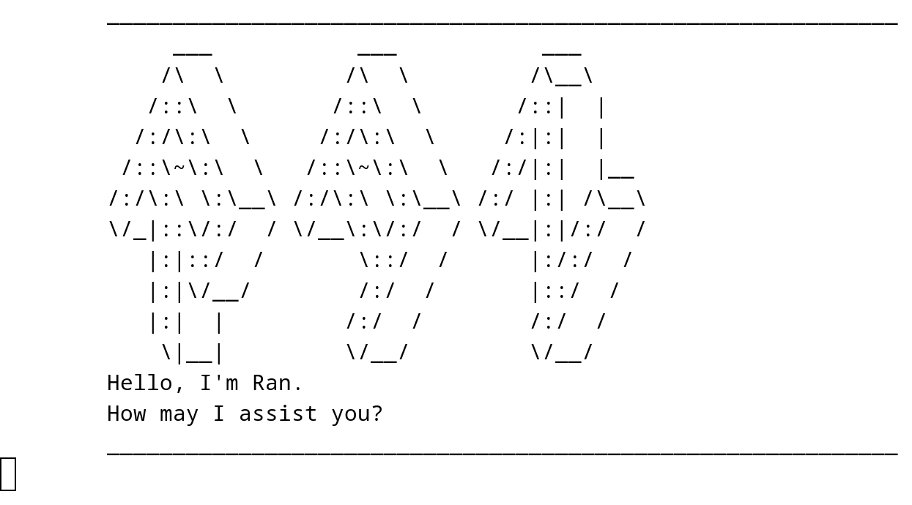

# Ran User Guide



### Ran? Ran Yakumo? From Touhou Project?
Yes!
The power of Ran Yakumo, from the hit video-game series Touhou Project, in the chasis of your computer.
Yukari Yakumo has agreed to loan out a tiny portion of her beloved Shikigami's power towards making a chatbot.
Harness a small percentage of Ran's intellect to help you manage your day-to-day tasks! 

# Quick Start
1. Ensure that you have Java `17` installed on your computer.
2. Download the latest `ran.jar` file from [here](https://github.com/3CCLY/ip/releases).
3. Navigate to the directory where `ran.jar` is installed, and relocate it to whichever directory you please.
4. Open the terminal, and `cd` into the directory of `ran.jar`, and run the command `java -jar ran.jar` to start the chatbot.
5. If all goes well, you should see the screen look something like the picture above.
6. Use commands listed in the [Features](#features) section to get Ran to manage your tasks.
7. Type `bye` to terminate the Ran chatbot.

# Features

## Add a Todo Task: `todo`

## Add a Deadline Task: `deadline`

## Add an Event Task: `event`

## Show list of all tasks: `list`

## Mark task as done: `mark`

## Unmark task (set as not done): `unmark`

## Delete task from list: `delete`

## Find task: `find`

## Terminate chatbot: `bye`

## Adding deadlines

// Describe the action and its outcome.

// Give examples of usage

Example: `keyword (optional arguments)`

// A description of the expected outcome goes here

```
expected output
```
// Feature details
