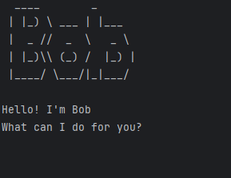

# Bob User Guide

When you run the application, the welcome screen shown below should appear and Bob is ready to accept your input from
the keyboard!<br>


Welcome to Bob, your personal task management chatbot!
It is a desktop app optimised for use via a Command Line Interface (CLI).
Bob helps you keep track of your todos, deadlines and events with ease.
You can add a task (todo, deadline or event), view the task list, search for tasks using keywords, mark a task as done, 
unmark a task as not done and delete a task.

## Add todo
Add a todo to the task list.

> Command: todo [description]

_Example:_ 
```
todo read book 
```

_Expected output:_
```
____________________________________________________________
Got it. I've added this task:
  [T][ ] read book
Now you have 1 task in the list.
____________________________________________________________
```

## Add deadline
Add a deadline with a specific due date to the task list.

> Command: deadline [description] /by [due date]

_Example of command input:_
```
deadline return book /by June 6th
```

_Expected output:_
```
____________________________________________________________
Got it. I've added this task:
  [D][ ] return book (by: June 6th)
Now you have 2 tasks in the list.
____________________________________________________________
```

## Add event
Add an event with a start and end time to the task list.

> Command: event [description] /from [start time] /to [end time]

_Example of command input:_
```
event project meeting /from Aug 6th 2pm /to 4pm
```

_Expected output:_
```
____________________________________________________________
Got it. I've added this task:
  [E][ ] project meeting (from: Aug 6th 2pm to: 4pm)
Now you have 3 tasks in the list.
____________________________________________________________
```

## View the task list
Display all tasks in the task list, together with the done status for each task. 

_Command input:_ 
```
list
```

_Expected output:_
```
____________________________________________________________
Here are the tasks in your list:
1.[T][ ] read book
2.[D][ ] return book (by: June 6th)
3.[E][ ] project meeting (from: Aug 6th 2pm to: 4pm)
____________________________________________________________
```

## Search for tasks using keywords
Search for tasks using a keyword or multiple keywords.

> Command: find [keyword/keywords]

_Example of command input (Single keyword):_
```
find book
```

_Expected output:_
```
____________________________________________________________
Here are the matching tasks in your list:
1.[T][ ] read book
2.[D][ ] return book (by: June 6th)
____________________________________________________________
```

_Example of command input (Multiple keywords):_
```
find project meeting
```

_Expected output:_
```
____________________________________________________________
Here are the matching tasks in your list:
3.[E][ ] project meeting (from: Aug 6th 2pm to: 4pm)
____________________________________________________________
```

## Mark a task as done
Mark a task as done to show a "X" beside the task description.

> Command: mark [task number]

_Example of command input:_
```
mark 1
```

_Expected output:_
```
____________________________________________________________
Nice! I've marked this task as done:
  [T][X] read book
____________________________________________________________
```

## Unmark a task as not done
Unmark a task as not done to remove the "X" beside the task description.

> Command: unmark [task number]

_Example of command input:_
```
unmark 1
```

_Expected output:_
```
____________________________________________________________
OK, I've marked this task as not done yet:
  [T][ ] read book
____________________________________________________________
```

## Delete a task 
Delete a task from the task list.

> Command: delete [task number]

_Example of command input:_
```
delete 1
```

_Expected output:_
```
____________________________________________________________
Noted. I've removed this task:
  [T][ ] read book
Now you have 2 tasks in the list.
____________________________________________________________
```

Now, if you input the command:
```
list
```

_Expected output:_
```
____________________________________________________________
Here are the tasks in your list:
1.[D][ ] return book (by: June 6th)
2.[E][ ] project meeting (from: Aug 6th 2pm to: 4pm)
____________________________________________________________
```

## Exit the program
Exit the chatbot.

_Command input:_
```
bye
```

_Expected output:_
```
____________________________________________________________
Bye. Hope to see you again soon!
____________________________________________________________
```

## Automatic Saving and Retrieval of Tasks
Bob automatically saves your tasks to a file after each operation (adding, deleting, marking/unmarking tasks). 
This means you don't have to worry about losing your progress!

### How It Works:
1. **Auto-Saving:**
Every time you add, delete, mark or unmark a task, Bob automatically saves the updated task list to a file.

2. **Auto-Loading on Startup:**
When you start Bob again, the program will automatically load your previously saved tasks from the file, allowing you 
to continue from where you left off.

This feature ensures that all tasks persist even after you exit the application, providing a seamless user experience.