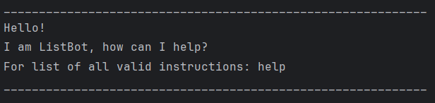

# ListBot User Guide



ListBot is a task management system designed to help you keep track of your to-dos, deadlines, and events. With simple commands, you can easily add, mark, and organize your tasks directly from the command line.

## Adding To-dos
The todo command adds a simple task with no deadline.

**Example:** `todo Get lunch`

**Expected output:**
```
____________________________________________________________
Added: 1.[T][ ] Get lunch
____________________________________________________________

```

## Adding Deadlines

To add a deadline to your task list, use the deadline command, followed by the task description and the /by argument to specify when the deadline is due.


**Example:** `deadline Complete quiz /by 25/09/2024 18:00`

**Expected Output:**

```
____________________________________________________________
Added: 2.[D][ ] Complete quiz BY: 25/09/2024 18:00
____________________________________________________________
```

## Adding Events

To add an event, use the event command along with /from and /to to specify the start and end time.

**Example:** `event Lecture /from Friday 16:00 /to Friday 18:00`

**Expected Output:**

```
____________________________________________________________
Added: 3.[E][ ] Lecture FROM: Friday 16:00 TO: Friday 18:00
____________________________________________________________
```


## Marking and Unmarking Tasks

To mark a task as complete: `mark 2`

This marks the task at index 2 as complete.

**Expected Output:**
```
____________________________________________________________
Marked the following task: 
2.[D][X] Complete quiz BY: 25/09/2024 18:00
____________________________________________________________
```

To unmark a task as complete: `unmark 2`

This unmarks the task at index 2 as complete.

**Expected Output:**
```
____________________________________________________________
Unmarked the following task:
2.[D][ ] Complete quiz BY: 25/09/2024 18:00
____________________________________________________________
```

## Viewing the Task List

To display all tasks:

`list`

**Expected Output:**

```
____________________________________________________________
The list has 3 tasks.
1.[T][ ] Get lunch
2.[D][ ] Complete quiz BY: 25/09/2024 18:00
3.[E][ ] Lecture FROM: Friday 16:00 TO: Friday 18:00
____________________________________________________________
```

## Deleting Tasks
To delete a task: `delete 1`

This deletes the task at index 1.

**Expected Output:**
```
____________________________________________________________
Deleted the following task:
1.[T][ ] get lunch
____________________________________________________________
```

## Searching for tasks

To search for tasks by keyword:

**Example Input:** `find quiz`

**Expected Output:**
```
____________________________________________________________
The following tasks match:
1.[D][ ] Complete quiz BY: 25/09/2024 18:00
____________________________________________________________
```

## Listing all Commands

To list all commands: `help`

**Expected Output:**
```
____________________________________________________________
All actions:
To add a deadline: deadline *task* /by *by*
To add a todo: todo *task*
To add an event: event *task* /from *from* /to *to*
To mark a task: mark *task_number*
To unmark a task: unmark *task_number*
To delete a task: delete *task_number*
To list all tasks: list
To find a task: find *keyword*
To exit: bye
____________________________________________________________
```

## Exiting the Program

To exit ListBot: `bye`

**Expected Output:**
```
____________________________________________________________
Your list has been saved successfully.
____________________________________________________________
Let me know if I can help again!
Bye!
____________________________________________________________
```


## Invalid commands

Any unrecognized commands will print an error message and the correct syntax.

**Example:** `delete hello`

**Expected output:**
```
____________________________________________________________
This is an invalid delete statement.
Here's the delete syntax: 
delete *task_number*
For list of all valid instructions: help
____________________________________________________________

``` Feature details