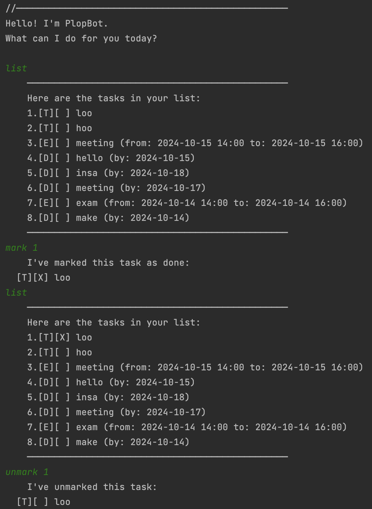

# PlopBot User Guide



PlopBot is a user-friendly task management application that helps you keep track of your to-dos, deadlines, and events. With its simple command-line interface, you can easily add, view, and manage your tasks.


## Adding Tasks

### 1. Adding To-Dos

To add a simple to-do task:

    todo <task description>
    
Example: 'todo Buy Groceries'

```
Expected output:
    Added: [T][ ] Buy Groceries
    You now have 1 tasks in the list.
```   
    
### 2. Adding Deadlines

To add a task with a deadline:

    deadline <task desscription> /by <date>
    
Example: 'deadline Submit Report /by 2024-01-01'

```
Expected output:
    Added: [D][ ] Submit Report (by: 2024-01-01)
    You now have 2 tasks in the list.
```  

Note: Dates can be in the format 'YYYY-MM-DD', or day names like 'Monday', 'Tue', etc.

### 3. Adding Events

To add an event:
    
    event <task description> /from <start time> /to <end time>
    
Example: 'event Team meeting /from 2023-06-10 14:00 /to 2023-06-10 15:30'

```
Expected output:
    Added: [E][ ] Team meeting (from: 2023-06-10 14:00 to: 2023-06-10 15:30)
    You now have 3 tasks in the list.
```


## Viewing Tasks

To view all your tasks, simply write:

    list
    
```
Expected output:
    Here are the tasks in your list:
    1.[T][ ] Buy Groceries
    2.[D][ ] Submit Report (by: 2024-01-01)
    3.[E][ ] Team meeting (from: 2023-06-10 14:00 to: 2023-06-10 15:30)
```


## Marking Tasks as Complete

To mark a task as 'done':

    mark <task number>

Example: 'mark 1'

```
Expected output:
    I've marked this task as done:
    [T][X] Buy Groceries
```


## Unmarking Tasks

To unmark a task:

    unmark <task number>
    
Example: 'unmark 1'

```
Expected output:
    I've unmarked this task:
    [T][ ] Buy Groceries
```


## Deleting Tasks

To delete a task:

    delete <task number>

Example: 'delete 2'

```
Expected output:
    Removed: [D][ ] Submit Report (by: 2024-01-01)
    You now have 2 tasks in the list.
```


## Finding Tasks

To find tasks containing a keyword:

    find <keyword>
    
Example: 'find meeting'

```
Expected output:
    Here are the matching tasks in your list:
    1.[E][ ] Team meeting (from: 2023-06-10 14:00 to: 2023-06-10 15:30)
```


## Exiting PlopBot

To exit the program, simply write one of the following:

    bye
    exit
    quit
    
```
Expected output:
    Thank you for choosing PlopBot. Have a great day!
```
