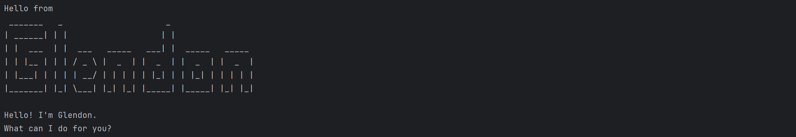

# Glendon User Guide



Glendon is a desktop app for managing tasks optimized for use via a 
Command Line Interface. If you can type fast, Glendon can get your 
task management tasks done faster than traditional GUI apps.

## Adding todo
Adding a todo task to the list of tasks\
Format: todo TASK_NAME\
Example: `todo read book`

```
Expected Output:

--------------------------------------------------------------------------
    Got it. I've added this task:
        [T][ ] read book
    Now you have 1 tasks in the list.
--------------------------------------------------------------------------
```

## Adding deadlines

Adding a task with deadline to the list of tasks\
Format: deadline TASK_NAME /by DUE_DATE\
Example: `deadline return book /by Friday`

```
Expected Output:

--------------------------------------------------------------------------
    Got it. I've added this task:
        [D][ ] return book (dueTime: Friday)
    Now you have 2 tasks in the list.
--------------------------------------------------------------------------
```

## Adding events

Adding an event task to the list of tasks\
Format: event TASK_NAME /from START_DATE /to END_DATE\
Example: `event go return book /from Friday 8am /to 12pm`

```
Expected Output:

--------------------------------------------------------------------------
    Got it. I've added this task:
        [E][ ] go return book (from: Friday 8am to: 12pm)
    Now you have 3 tasks in the list.
--------------------------------------------------------------------------
```

## Finding a Task
Find tasks containing the given keyword\
The function is case-insensitive and will only search for the task name\
Format: find KEYWORD\
Example: `find book` or `find Book`

```
Example Output

--------------------------------------------------------------------------
    Here are the tasks with the specific task name:
        1. [T][ ] read book
        2. [D][ ] return book (dueTime: Friday)
        3. [E][ ] go return book (from: Friday 8am to: 12pm)
--------------------------------------------------------------------------

```

## Deleting a Task
Deletes the task based on the given task number\
The delete function will only work on the task number and not the task name\
Format: delete TASK_NUMBER\
Example: `delete 1`

```
Example Output

--------------------------------------------------------------------------
    Noted. I've removed this task:
        [T][ ] read book
    Now you have 2 tasks in the list
--------------------------------------------------------------------------
```

## Listing all tasks
List the current list of task\
Format: list\
Example: `list`

```
Example Output

--------------------------------------------------------------------------
    Here are the tasks in your list:
        1. [D][ ] return book (dueTime: Friday)
        2. [E][ ] go return book (from: Friday 8am to: 12pm)
--------------------------------------------------------------------------
```

## Marking a Task
Marks a task completion status based on the given task number\
The mark function will only work on the task number and not the task name\
Format: mark TASK_NUMBER\
Example: `mark 1`

```
Example Output

--------------------------------------------------------------------------
    Nice! I've marked this task as done:
        [D][X] return book (dueTime: Friday)
--------------------------------------------------------------------------
```

## Unmarking a Task
Unmarks a task completion status based on the given task number\
The unmark function will only work on the task number and not the task name\
Format: unmark TASK_NUMBER\
Example: `unmark 1`

```
Example Output

--------------------------------------------------------------------------
    OK, I've marked this task as not done yet:
        [D][ ] return book (dueTime: Friday)
--------------------------------------------------------------------------
```

## Exiting the program
Exits the chatbot\
Format: bye

```
Example Output

--------------------------------------------------------------------------
    Bye. Hope to see you again soon!
--------------------------------------------------------------------------
```
## Saving of tasks
All tasks will be saved upon the exiting of chatbot using the exiting function

## Loading of previously saved tasks
All tasks that were saved previously during the last usage of the chatbot will automatically be loaded upon activating
of the chatbot

## Command Summary


| Action   |                    Format                     |
|----------|:---------------------------------------------:|
| Todo     |                todo TASK_NAME                 |
| Deadline | deadline TASK_NAME /by DUE_DATE|
| Event    | event TASK_NAME /from START_DATE /to END_DATE |
| Find     | find KEYWORD|
| Delete   | delete TASK_NUMBER|
| List     | list|
| Mark     | mark TASK_NUMBER|
|  Unmark  | unmark TASK_NUMBER|


