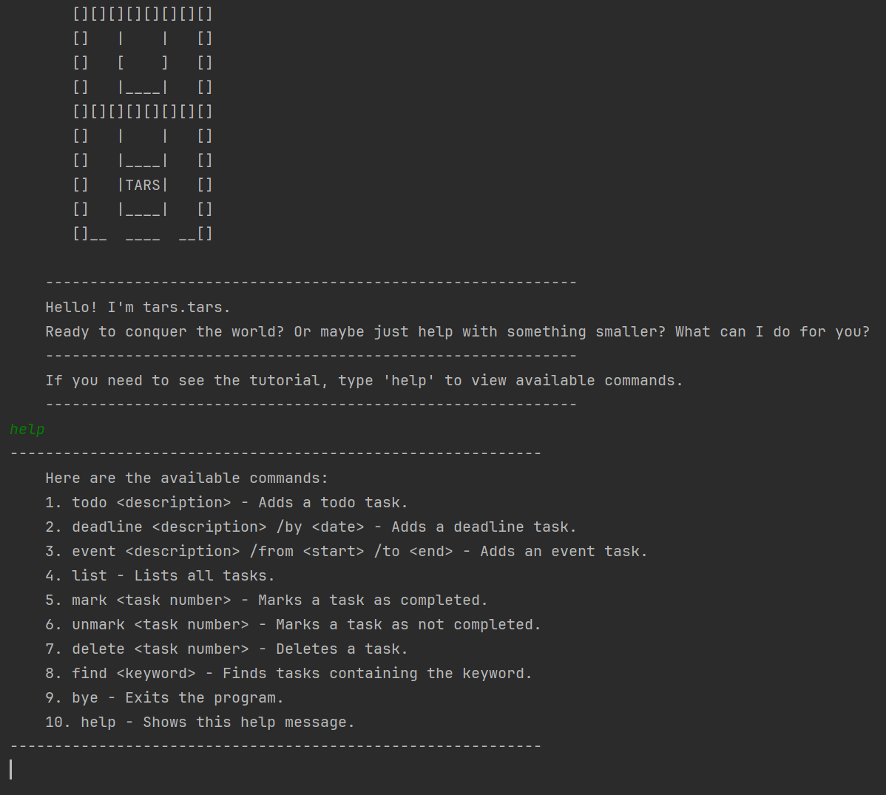

# SuBOT User Guide



Your personal chatbot for managing tasks and events!

------------------------------------------------------

- [Introduction](#introduction)
- [Features](#features)
  - [`Todo` task](#todo-task)
  - [`Deadline` task](#deadline-task)
  - [`Event` task](#event-task)
  - [Managing tasks](#managing-tasks)
  - [Quality of life](#quality-of-life)
- [Requirements](#requirements)
- [How to run](#how-to-run)
- [License](#license)

------------------------------------------------------

## Introduction

Evolve your paper calendar for a smarter, lighter and more convenient experience.

With `Todo`, `Deadline` and `Event`, you can plan ahead and take note of your moment without any worries!

Example:
```
todo World domination
deadline Meet havocs KPI /by Saturday
event Fight with Batman /from Sunday 10 PM /to indefinite
list
```

Output:

```
1.[T][ ] World domination
2.[D][ ] Meet havocs KPI (by: Saturday)
3.[E][ ] Fight with Batman (from: Sunday 10 PM to: indefinite)
```
------------------------------------------------------

## Features:
We support 3 types of `Task`:
### `Todo` task:
Add a generic task with only description and no other constraints.
```
todo <description>
```
- Example: `todo World domination`

### `Deadline` task:
Task needs to be done before a specific time.
- Note that `<time>` cannot be empty.
```
deadline <description> /by <time> 
```
- Example: `deadline Meet havocs KPI /by Saturday`

### `Event` task:
Task with start and end time.
- Note that `<from>` and `<to>` cannot be empty. 
```
event <description> /from <from> /to <to>
```
- Example: `event Fight with Batman /from Sunday 10 PM /to indefinite`

### Managing tasks:
  + Add a task: Use one of the above commands.
  + List all tasks with index: `list`
  + Mark/unmark a task as done: `mark/unmark <taskNumber>`. Note that `taskNumber` starts from 1
  + Delete a task: `delete <taskNumber>`. Note that `taskNumber` starts from 1
  + Find a task: `find <query>`. Note that <query> is NOT case-sensitive.
  + Exit: `bye`
  + List of commands: `help`

### Quality of life:
- Autosave tasks to file before exit, default path is `<currentDirectory>/tasks.subot`
- Autoload tasks from file from last session.

------------------------------------------------------

## Requirements
- Java 17

------------------------------------------------------

## How to run
- Install [Java 17](https://www.oracle.com/java/technologies/javase/jdk17-archive-downloads.html).
- Download `.jar` file from [list of releases](https://github.com/Sukkaito/ip/releases).
- Go to the location of `.jar` file, open Command Prompt/Terminal and type:
```
java -jar SuBot.jar
```
- `Enter` and enjoy!

------------------------------------------------------

## License
[MIT license](https://opensource.org/license/MIT)
