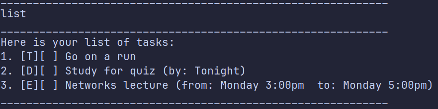

# Miku User Guide

Miku is a command line chat bot that can be used for managing different types of tasks.

The different types of tasks that Miku can handle are:
1. Todo (A task with no time constraints)
2. Deadline (A task with a due date/time)
3. Event (A task with a start and end time)

Miku is also able to store your data in a text file so that your work is not lost when you close the program.

## Listing out possible commands: `help`

A quick way to list out the syntax.

Format: `help`

## Adding a todo task: `todo`

Adds a todo task to the list.

Format: `todo /desc <description>`

Examples:
- `todo /desc Go on a run`
- `todo /desc Do the laundry`

If the task was added successfully, Miku will print a message along with a task.

## Adding deadlines: `deadline`

Adds a deadline task to the list.

Format: `deadline /desc <description> /by <dueBy>`

Examples:
- `deadline /desc Study for quiz /by Tonight`
- `deadline /desc Submit documents /by Friday`

If the task was added successfully, Miku will print a message along with a task.

## Adding event: `event`

Adds an event task to the list.

Format: `event /desc <description> /from <start> /to <end>`

Examples:
- `event /desc Networks Lecture /from Monday 3:00pm /to Monday 5:00pm`
- `event /desc Meet up with school friends /from 6:00pm /to 8:00pm`

If the task was added successfully, Miku will print a message along with a task.

## Listing the tasks: `list`

Prints a list of all the tasks.

Format: `list`

If there are no tasks, Miku will print a message telling you to add some tasks.
The tasks are printed out along with a serial number on the left which can be used as index for upcoming commands.

## Finding a task: `find`

Finds all the tasks containing a search term in their description.
The search term is case insensitive.

Format: `find /match <search_term>`

Examples:
- `find /match lecture`
- `find /match quiz`

## Marking a task: `mark`

Marks a task at a specified index (1-based indexing) as done or completed.

Format: `mark <index>`

Examples:
- `mark 1`
- `mark 2`

If the index is out of bounds, Miku print a message asking you to specify a valid index.
If the index is valid, the task is marked and a message along with the marked task is printed.

## Unmarking a task: `unmark`

Unmarks a task at a specified index (1-based indexing).

Format: `unmark <index>`

Examples:
- `unmark 1`
- `unmark 2`

If the index is out of bounds, Miku print a message asking you to specify a valid index.
If the index is valid, the task is unmarked and a message along with the unmarked task is printed.

## Deleting a task: `delete`

Deletes a task at a specified index (1-based indexing).

Format: `delete <index>`

Examples:
- `delete 1`
- `delete 2`

If the index is out of bounds, Miku print a message asking you to specify a valid index.
If the index is valid, the task is removed and a message along with the removed task is printed.

## Exiting the program: `bye`

Saves the tasklist and exits the program

Format: `bye`

