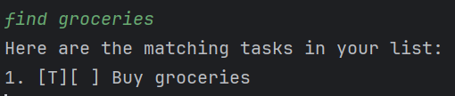

# LAMBO

Lambo is a command-line interface (CLI) chatbot designed to help you organize and schedule tasks efficiently. Manage your tasks directly from the terminal with ease.

## Features

Lambo supports different types of tasks: general todos, deadlines, and events. You can list, add, delete, mark as complete, or find tasks based on your needs.

### Adding Tasks

Lambo supports three types of tasks, each with its own command syntax:

#### 1. Adding Todos

This command adds a simple todo task without a date.

- **Syntax:**
  ```bash
  add [task description]
  ```

- **Example:**
  ```bash
  add Buy groceries
  ```

- **Expected Output:**  


---

#### 2. Adding Deadlines

This command allows you to add a task with a deadline.

- **Syntax:**
  ```bash
  deadline [task description] /by [yyyy-MM-dd]
  ```

- **Example:**
  ```bash
  deadline Submit report /by 2024-10-15
  ```

- **Expected Output:**

---

#### 3. Adding Events

This command adds an event task that spans a start and end date.

- **Syntax:**
  ```bash
  event [task description] /from [start date] /to [end date] 
  ```

- **Example:**
  ```bash
  event Company workshop /from 2024-10-20 /to 2024-10-22 
  ```

- **Expected Output:**  
  

---

### Listing Tasks

This command lists all the current tasks stored.

- **Syntax:**
  ```bash
  list
  ```

- **Example:**
  ```bash
  list
  ```

- **Expected Output:**  
  

---

### Marking a Task as Done

This command marks a specific task as done.

- **Syntax:**
  ```bash
  mark [task index]
  ```

- **Example:**
  ```bash
  mark 2
  ```

- **Expected Output:**  
  

---

### Unmarking a Task

This command unmarks a specific task as not done.

- **Syntax:**
  ```bash
  unmark [task index]
  ```

- **Example:**
  ```bash
  unmark 2
  ```

- **Expected Output:**  
  

---

### Deleting a Task

This command deletes a specific task based on its index.

- **Syntax:**
  ```bash
  delete [task index]
  ```

- **Example:**
  ```bash
  delete 3
  ```

- **Expected Output:**  
  

---

### Finding Tasks

This command finds tasks that match a keyword in their description.

- **Syntax:**
  ```bash
  find [keyword]
  ```

- **Example:**
  ```bash
  find groceries
  ```

- **Expected Output:**  
  

---

### Exit chatbot

This command finds tasks that match a keyword in their description.

- **Syntax:**
  ```bash
  bye
  ```

- **Example:**
  ```bash
  bye
  ```

- **Expected Output:**  
  

---